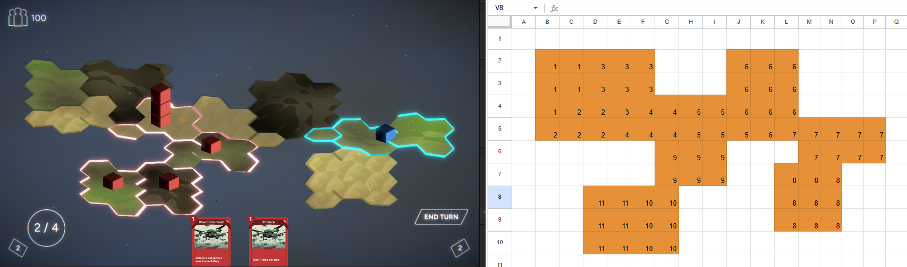

## Introduction

I have spent a lot of time of time thinking about how to make a simple and flexible level editor for the strategy game I am making. One aspect of this which I had a hard time getting my head around was how to design a level editor for a game where hexagons make up the level. That is untill I had, it is fair to say, a bit of a revelation:

## 1. It is possible to represent hexagonal maps with a 2d grid

Evgeniya Glazycheva has this great [blog post](https://medium.com/@glazychevaeo/hexagon-level-generator-from-2d-texture-3c0ac9e3cc07) describing how they generated their hexagonal levels based on a 2d texture of a colored grid. Assuming a vertical hexagonal orientation it is pretty simple to take data from the 2d texture and use it to generate a level.

## 2. Spreadsheets store data in a grid and can transmit more data than a 2d texture

My only issue with using a 2d texture is that it allows for only very little data to be stored and transfered for each hexagon. The solution to this, which I am stoked about coming up with haha!, is to use a spreadsheet grid instead of a grid drawn on a texture.

## 3. Enough data can be stored to produce a scriptable object describing a level made of hexagons

Using an online spreadsheet like Google sheets and building scriptable object in Unity([like shown here](https://medium.com/@xavidevsama/how-to-create-a-simple-backend-with-google-sheets-and-unity-the-easiest-solution-for-small-ef8a6de1bcd0)) give team members access to a colaborative level editor and does not burden me as the programmer with the task of making a level editor in-house. Pew, nice. 

