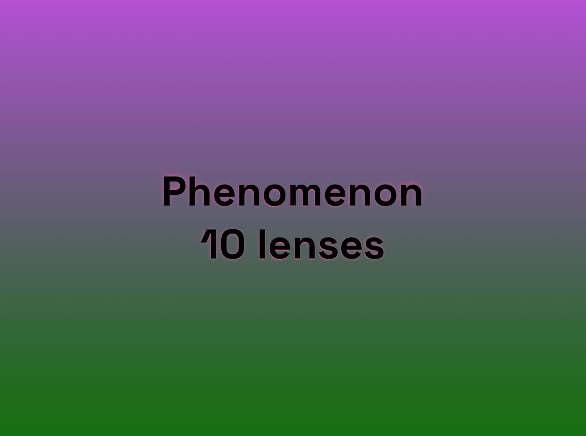

I like different eyes, different angles, different perspectives on things. That is what lenses are. I like to make my own and share them here.

## Phenomenon 10 lenses

[Phenomenon 10 lenses](phenomenon_10_lenses_compressed.pdf).
