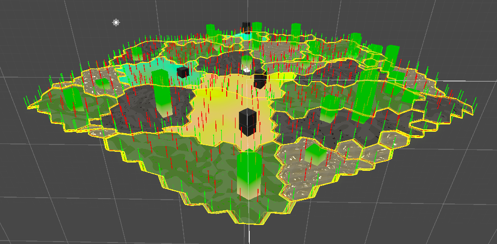

Here is a collection of spells!

## Five W and one H

[Five W and one H](https://www.pppdesign.net/blog.asp?bkey=154&Akey=) is a method for establishing context.

- Who
- What
- When
- Why
- How

## MoSCoW

[MoSCoW](https://www.agilebusiness.org/dsdm-project-framework/moscow-prioririsation.html) is a prioritisation technique borrowed from Agile. For scoping priorities. 
The letters stand for:

- **M**ust Have
- **S**hould Have
- **C**ould Have / Nice to have
- **W**on’t Have this time

## Lightweight social rules for learning spaces

The Recurse Center has some [nice social rules](https://www.recurse.com/manual#sub-sec-social-rules) which adress some of the behaviour which can be destructive to a good learning(or projecting) environment.

- **No feigning surprise** "You shouldn't act surprised when people say they don't know something."
- **No well-actuallys** "A well-actually happens when someone says something that's almost - but not entirely - correct, and you say, "well, actually…" and then give a minor correction."
- **No back-seat driving** "If you overhear people working through a problem, you shouldn't give advice unless you’re actively participating in the conversation."
- **No subtle -isms** "Our last social rule bans subtle racism, sexism, homophobia, transphobia, and other kinds of bias."

## Decision memos

[Decision memos](https://shorensteincenter.org/wp-content/uploads/2012/07/MEMO-WRITING-HO-ALL-Danziger.pdf) are short documents describing a problem, a solution, and how the solution was arrived at.

1. Define the problem 
2. Summarise your findings
3. Step back and show how you got there

## Some instructions for running a stand-up meeting

[Some instructions](standup_instructions.pdf) for running a stand-up meeting written by Richard Lemarchand for their book [A Playful Production Process](https://mitpress.mit.edu/9780262045513/a-playful-production-process/).

## A deck of lenses

[A deck](https://deck.artofgamedesign.com/#/menu/14/?lang=en) of perspectives to employ to a project. From the book The Art of Game Design by Jesse Schell.