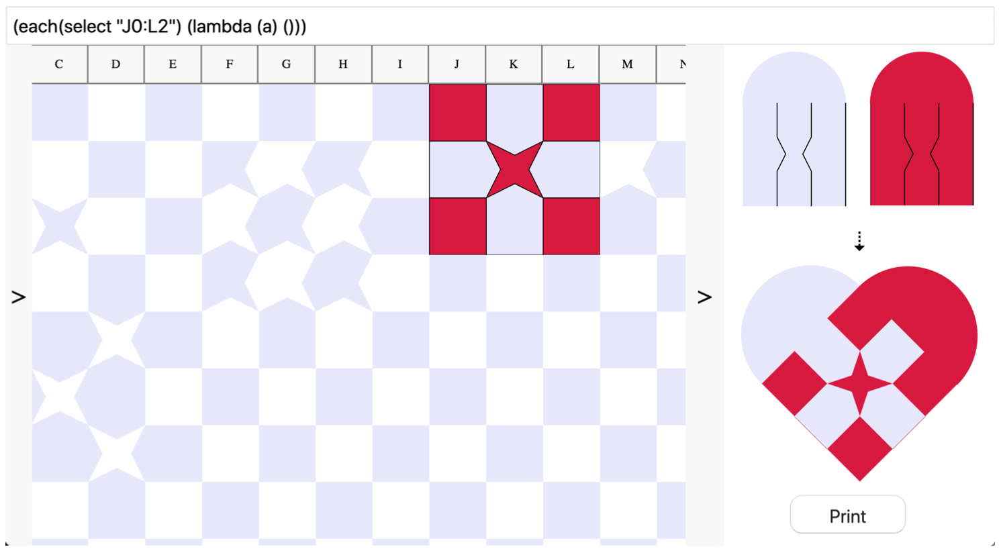

---

##### Download

+ [Paper](paper1.pdf)

---

##### Abstract

This work explores how spreadsheets can serve as the foundation for the creation of a hybrid design medium for paper weaving. The case for using spreadsheets as a model for the development of environments for designing paper weaving patterns is made. Firstly, because both spreadsheets as well as the woven form of paper weaving designs have cells as their elementary substrate. Secondly, because it allows for exploration of the design space. And thirdly, as it enables use by end-users with varying levels of experience. An environment, VisiWeave, implementing the points mentioned is presented and explored.

---

##### Figure 7: The VisiWeave interface with all panels open.



---

##### Citation

Jonathan Skjøtt. 2020. Spreadsheets as notational environment for paper weaving. In Companion Proceedings of the 4th International Conference on Art, Science, and Engineering of Programming (Programming '20). Association for Computing Machinery, New York, NY, USA, 158–162. https://doi.org/10.1145/3397537.3397545

```BibTeX
@inproceedings{10.1145/3397537.3397545,
author = {Skj\o{}tt, Jonathan},
title = {Spreadsheets as notational environment for paper weaving},
year = {2020},
isbn = {9781450375078},
publisher = {Association for Computing Machinery},
address = {New York, NY, USA},
url = {https://doi.org/10.1145/3397537.3397545},
doi = {10.1145/3397537.3397545},
abstract = {This work explores how spreadsheets can serve as the foundation for the creation of a hybrid design medium for paper weaving. The case for using spreadsheets as a model for the development of environments for designing paper weaving patterns is made. Firstly, because both spreadsheets as well as the woven form of paper weaving designs have cells as their elementary substrate. Secondly, because it allows for exploration of the design space. And thirdly, as it enables use by end-users with varying levels of experience. An environment, VisiWeave, implementing the points mentioned is presented and explored.},
booktitle = {Companion Proceedings of the 4th International Conference on Art, Science, and Engineering of Programming},
pages = {158–162},
numpages = {5},
keywords = {weaving, spreadsheets, end-user programming},
location = {Porto, Portugal},
series = {Programming '20}
}
```

---

